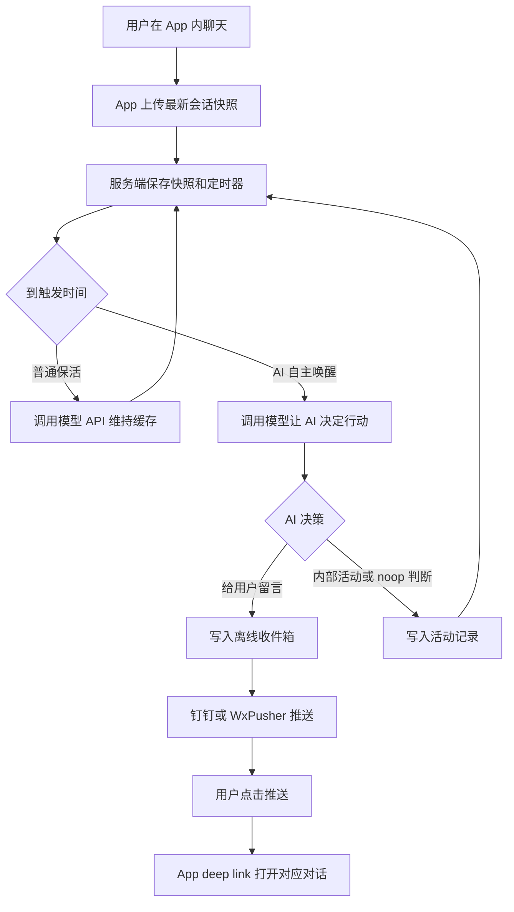

# 给聊天 App 做一套保活、自主活动和离线推送系统

这份教程解释 YSClaude Keepalive Server 的整体思路：用户离开 App 后，服务端继续维持可恢复的对话上下文；AI 可以在合适的时间醒来，决定是否留言、记录一次后台判断，或暂时不打扰；如果需要提醒用户，服务端通过钉钉或 WxPusher 发送推送，用户点击后回到对应对话。

当前项目只保留两种推送方式：

- 钉钉自定义机器人
- WxPusher

## 目标

这套系统要解决四件事：

1. 用户最后一次对话后，App 把必要的上下文快照上传到服务端。
2. 服务端在用户离线时继续保活缓存，避免长上下文失效。
3. AI 可以定时自主醒来，决定给用户留言、做内部活动记录，或者什么都不做。
4. 如果 AI 给用户留言，服务端发送推送；用户点击推送后，App 打开对应对话并同步离线记录。

这里的“保活”可以是 Prompt Cache 保活，也可以是其他会话状态保活。核心思想是：客户端把可恢复的会话状态交给可信服务端，服务端在用户离线时接管定时任务。

## 总体架构



服务端不需要知道 App 的完整 UI，只需要知道：

- 会话 ID。
- 模型请求参数。
- 当前消息列表。
- 推送配置。
- 勿扰时间。
- AI 自主活动可用的工具配置。

## 一、客户端上传快照

当用户完成一次成功请求后，客户端把“下一次服务端可以复现请求”的数据上传到服务端。

示例：

```json
{
  "conversationId": "abc-123",
  "updatedAt": 1760000000000,
  "quietHours": {
    "enabled": true,
    "startMinutes": 1380,
    "endMinutes": 420
  },
  "request": {
    "baseUrl": "https://api.example.com/v1",
    "apiKey": "sk-...",
    "model": "your-model",
    "sessionId": "abc-123",
    "messages": [
      {"role": "user", "content": "今天下午提醒我复盘。"},
      {"role": "assistant", "content": "好，我会记得。"}
    ],
    "promptCache": {
      "enabled": true,
      "ttl": "1h"
    }
  },
  "agentTick": {
    "enabled": true
  },
  "push": {
    "provider": "dingtalk",
    "dingTalk": {
      "webhook": "https://oapi.dingtalk.com/robot/send?access_token=...",
      "secret": "SEC...",
      "atMobiles": []
    }
  }
}
```

WxPusher 配置示例：

```json
{
  "push": {
    "provider": "wxpusher",
    "wxPusher": {
      "appToken": "AT_xxx",
      "uids": ["UID_xxx"],
      "topicIds": []
    }
  }
}
```

关键点：

- `conversationId` 用来让推送点击后回到对应会话。
- `messages` 必须能还原服务端下一次请求。
- `updatedAt` 或服务端接收时间要记录为“用户最后一次上传快照时间”。
- API Key 会保存在服务端，所以这个服务必须是你可信任和可控制的。

## 二、普通保活

Prompt Cache 通常有 TTL，比如 1 小时。为了避免过期，服务端可以在 55 分钟左右做一次普通保活。

普通保活不需要 AI 真的回复用户。通常做法是调用同一个模型请求，但尽量让输出为空或极短：

```json
{
  "model": "your-model",
  "messages": "...快照中的 messages...",
  "max_tokens": 0,
  "stream": false
}
```

有些模型或网关不允许 `max_tokens: 0`，可以失败后退回 `max_tokens: 1`。

还有一个常见问题：如果快照最后一条是 `assistant`，有些模型会要求对话必须以 `user` 消息结尾。这时服务端可以只在普通保活请求里临时追加一条 user ping：

```json
{
  "role": "user",
  "content": "[Server keepalive ping] Keep the prompt cache warm. Do not answer this message."
}
```

这条 ping 不要写回真实快照，也不要同步到 App 聊天记录。它只用于让本次保活请求合法。

## 三、AI 自主唤醒

普通保活只是维持缓存；自主唤醒才是“AI 离线时也能思考和行动”的核心。

每次 AI 被唤醒时，服务端在原始对话后追加一条临时 user prompt，告诉 AI：

```text
Current server time: 2026-07-04T12:00:00.000Z
This wake was planned for: 2026-07-04T12:00:00.000Z
Last user snapshot time: 2026-07-04T10:35:00.000Z
Minutes since last user snapshot: 85

You are running a server-side autonomous activity tick.
You may:
- do nothing
- leave a message for the user
- write an internal activity record

Always return JSON.
Every final JSON object must include "next_awake".
```

为什么要记录 `Last user snapshot time`？

因为普通保活可能每 55 分钟执行一次，但那不代表用户和 AI 聊天了。AI 做决策时真正关心的是“距离用户最后一次说话多久”，而不是“距离服务器上次保活多久”。

推荐让 AI 只返回 JSON。

给用户留言：

```json
{
  "action": "user_message",
  "message": "我想提醒你，下午可以留 10 分钟复盘一下今天的重点。",
  "reason": "用户之前提到想要复盘提醒。",
  "next_awake": "2026-07-04T14:30:00.000Z"
}
```

不打扰：

```json
{
  "action": "noop",
  "reason": "当前用户可能正在忙，暂时不打扰。",
  "next_awake": "2026-07-04T15:00:00.000Z"
}
```

内部活动：

```json
{
  "action": "agent_activity",
  "summary": "整理了用户今天提到的计划，但暂时不推送。",
  "messagesToAppend": [
    {
      "role": "assistant",
      "content": "[远程自主活动记录] 用户今天可能需要复盘提醒。"
    }
  ],
  "next_awake": "2026-07-04T14:30:00.000Z"
}
```

当前实现里，`noop` 的 `reason` 也会写成一条 `[远程自主判断]`，同步回 App 本地聊天记录。

## 四、next_awake 调度策略

让 AI 自己决定下一次醒来的时间，可以避免每 55 分钟都完整思考一次。

服务端调度规则：

- 如果 `next_awake <= 当前时间 + 55 分钟`：直接在 `next_awake` 唤醒 AI。
- 如果 `next_awake > 当前时间 + 55 分钟`：先在 55 分钟后执行普通保活，然后继续比较。
- 如果 `next_awake` 缺失、格式错误、已经过去，或距离当前太近：兜底为 `当前时间 + 55 分钟`。

伪代码：

```js
function computeNextSchedule(now, nextAwakeAt) {
  const keepaliveInterval = 55 * 60 * 1000;

  if (!nextAwakeAt) {
    return { triggerAt: now + keepaliveInterval, type: "agent-wake" };
  }

  if (nextAwakeAt - now <= keepaliveInterval) {
    return { triggerAt: nextAwakeAt, type: "agent-wake" };
  }

  return { triggerAt: now + keepaliveInterval, type: "keepalive" };
}
```

这样可以同时满足两个目标：

- 缓存不会因为 AI 设定了很久以后才醒而过期。
- AI 不会被迫每 55 分钟都完整思考一次。

## 五、离线收件箱和活动记录

当 AI 决定给用户留言时，不建议只发推送。推送可能失败，用户也可能换设备。

更稳的做法是先写入服务端离线收件箱：

```json
{
  "id": "msg-001",
  "role": "assistant",
  "content": "我想提醒你，下午可以复盘一下。",
  "createdAt": 1760000000000,
  "source": "remote-agent",
  "consumed": false
}
```

App 启动、回到前台，或打开某个对话时：

1. 请求服务端状态，找出有未消费消息或活动记录的会话。
2. 拉取 `/inbox?conversationId=...` 和 `/activity?conversationId=...`。
3. 写入本地数据库。
4. 写入成功后调用 `/inbox/ack` 和 `/activity/ack`。

这样即使推送丢了，消息和活动记录也不会丢。

## 六、钉钉推送和 WxPusher 推送

推送只负责“叫醒用户”，真实消息以离线收件箱和活动记录为准。

### 钉钉

钉钉适合已经安装钉钉、并希望用现成 App 接收提醒的场景。

服务端需要：

```text
DINGTALK_WEBHOOK=https://oapi.dingtalk.com/robot/send?access_token=...
DINGTALK_SECRET=SEC...
DINGTALK_AT_MOBILES=
DINGTALK_TITLE=YSClaude
```

推送正文只包含：

```text
消息预览

打开 YSClaude
```

`DINGTALK_TITLE` 是钉钉 markdown 的内部标题字段，不作为正文第一行显示。

### WxPusher

WxPusher 适合希望用 WxPusher App 或其通知能力接收提醒的场景。

服务端需要：

```text
WXPUSHER_APP_TOKEN=AT_xxx
WXPUSHER_UIDS=UID_xxx
WXPUSHER_TOPIC_IDS=
```

也可以由 App 按会话上报配置：

```json
{
  "provider": "wxpusher",
  "wxPusher": {
    "appToken": "AT_xxx",
    "uids": ["UID_xxx"],
    "topicIds": []
  }
}
```

## 七、deep link

推送 payload 里带一个 URL：

```text
ysclaude://chat/{conversationId}
```

用户点击推送后：

1. 系统打开 App。
2. App 解析 deep link。
3. App 加载 `conversationId` 对应会话。
4. App 同步远程收件箱和活动记录。
5. 等待同步时，聊天列表底部显示加载提示。

在 Android 中，需要在 manifest 中声明 scheme：

```xml
<intent-filter>
  <action android:name="android.intent.action.VIEW" />
  <category android:name="android.intent.category.DEFAULT" />
  <category android:name="android.intent.category.BROWSABLE" />
  <data android:scheme="ysclaude" />
</intent-filter>
```

如果使用 Expo Router，可以准备一个类似 `/chat/[id]` 的中转页：

```ts
const { id } = useLocalSearchParams();
await loadConversation(id);
syncRemoteInbox({ preferredConversationId: id, showLoading: true });
router.replace("/");
```

## 八、自主活动工具

自主活动工具要谨慎开放。

建议：

- 优先开放云端只读工具，例如记忆搜索、日记查询、网页搜索。
- 不要默认开放手机本地控制、文件系统、命令执行、支付、发消息等高风险工具。
- 每个工具都要有超时、错误处理和结果摘要。
- 工具调用结果可以写进 activity log，方便用户审计。

工具定义可以是 OpenAI-compatible function calling：

```json
{
  "type": "function",
  "function": {
    "name": "search_memory",
    "description": "Search long-term memory.",
    "parameters": {
      "type": "object",
      "properties": {
        "query": {"type": "string"}
      },
      "required": ["query"]
    }
  }
}
```

不同 App 可以替换自己的工具集，但服务端调度、收件箱、活动记录和推送机制不需要改变。

## 九、勿扰和清理策略

离线 AI 最容易让用户不舒服的点是“它在不该出现的时候出现”。

建议至少支持勿扰时间：

- 进入勿扰时间后，不再保活。
- 清空服务端快照和 timer。
- 清空待收件箱和活动记录。
- 持久化写回空状态，避免服务重启后恢复。

这是一个明确的隐私边界：到点以后，服务端不再保留可继续行动的上下文。

## 十、安全边界

这套系统会保存模型 API Key 和对话快照，所以必须认真处理安全问题：

- 服务端必须有鉴权，例如 Bearer token。
- 尽量部署在你控制的机器或可信平台。
- 不要把管理面板裸露到公网。
- 尽量使用 HTTPS。
- 不要记录完整 API Key 到日志。
- 推送内容只放摘要，不放敏感长文本。
- AI 自主活动要有开关，用户能随时关闭。

## 最小接口清单

一个可用的服务至少需要：

```text
GET  /health
GET  /status
POST /snapshot
POST /disable
GET  /inbox?conversationId=...
POST /inbox/ack
GET  /activity?conversationId=...
POST /activity/ack
POST /push-token
POST /push-test
```

其中最重要的是：

- `/snapshot`：客户端上传最新状态。
- `/inbox`：客户端同步 AI 离线留言。
- `/activity`：客户端同步 AI 自主活动和 noop 判断。
- `/disable`：客户端关闭保活。

## 总结

这套方案的核心不是让 AI 一直在线，而是把离线行为拆成几个清晰、可控、可审计的模块：

- 快照负责恢复上下文。
- 普通保活负责维持缓存。
- 自主 tick 负责让 AI 在合适时间醒来。
- `next_awake` 负责让 AI 自己安排节奏。
- 离线收件箱负责保证消息不丢。
- 活动记录负责让后台判断可见。
- 钉钉和 WxPusher 负责把用户带回正确对话。
- 勿扰清理负责给用户一个明确边界。
